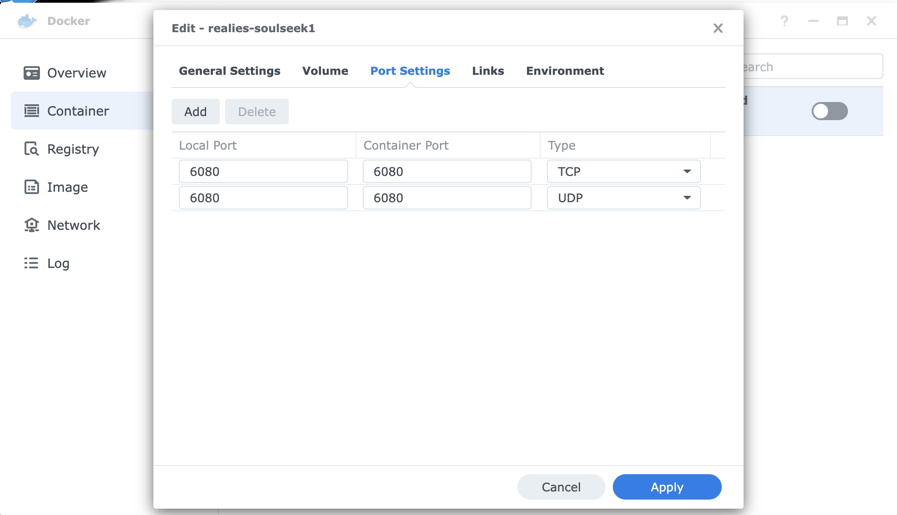

# Soulseek Over noVNC Docker Container


## Usage

1. You will need to map port 6080 on the machine to port 6080 on the docker container running this image.  
    * If you are using a GUI or webapp (e.g. Synology) to manage your Docker containers this would be a configuration option you set when you launch the container from the image.  
    * With the Docker CLI the option is `-p 6080:6080`.
Once that is done you should be able to connect to the machine on port 6080 with a standard web browser through the magic of `noVNC`.  Example: if your docker VM machine has IP `192.168.1.23` you should be able to connect to the Soulseek app running in docker by typing `https://192.168.1.23:6080` in your browser after launching the container.
1. Woof

##### Configuration Parameters

```
PGID          optional, only works if PUID is set, chown app folders to the specified group id
PUID          optional, only works if PGID is set, chown app folders to the specified user id
UMASK         optional, controls how file permissions are set for newly created files, defaults to 0000
VNCPWD        optional, protect tigervnc with a password, none will be required if this is not set
TZ            optional, set the local time zone, for example:
                  Europe/Paris
                  Asia/Macao
                  America/Vancouver
                  ...other values available in /usr/share/zoneinfo
```

### How To Launch
##### Using Docker Compose

```
docker-compose up -d
```

##### Using Docker CLI

```
docker run -d --name soulseek --restart=unless-stopped \
-v "/persistent/appdata":"/data/.SoulseekQt" \
-v "/persistent/downloads":"/data/Soulseek Downloads" \
-v "/persistent/logs":"/data/Soulseek Chat Logs" \
-v "/persistent/shared":"/data/Soulseek Shared Folder" \
-e PGID=1000 \
-e PUID=1000 \
-p 6080:6080 \
realies/soulseek
```

##### Using Docker On Synology DSM

