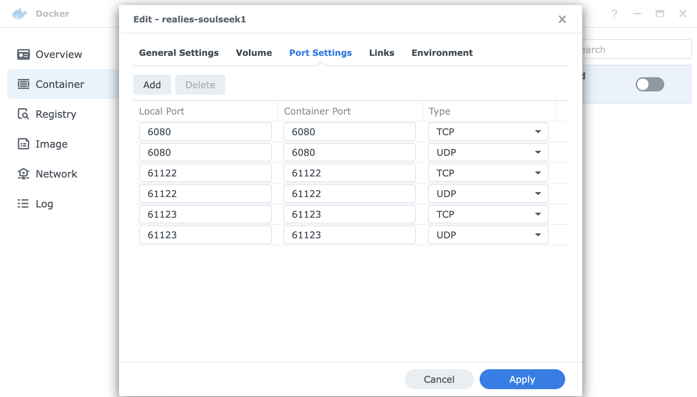
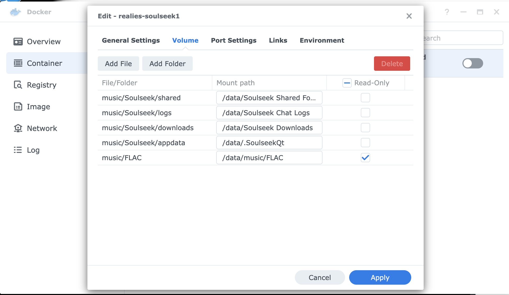

# Soulseek Over noVNC Docker Container


## Setup

1. **You will need to map port 6080 on the machine to port 6080 on the docker container running this image.**
    * If you are using a GUI or webapp (e.g. Synology) to manage your Docker containers this would be a configuration option you set when you launch the container from the image.  
    * With the Docker CLI the option is `-p 6080:6080`.
1. **You will need to map whatever port Soulseek wants to use on the Docker container.**  Soulseek starts up with different (random?) ports. These can be configured from within Soulseek but whatever those ports are, they need to be mapped a) from your router to the machine hosting this docker image and b) from the outside of the docker image to the server within it.  See below for more details.
1. **You will probably also want to set up a place on the local disk for Soulseek to work with/download to/etc.**  While you can of course just point the app at existing folders it is probably wiser to give the app its own siloed off location on disk.  Soulseek needs four folders to work with.  As an example let's say you wanted Soulseek to work in the `/persistent/Soulseek` directory.  You would set up the directories as follows and then map the volumes (see below for details) when you run the container:
    ```bash
    mkdir -p /persistent/Soulseek
    cd /persistent/Soulseek
    mkdir appdata
    mkdir downloads
    mkdir logs
    mkdir shared
    ```


Once that is done you should be able to connect to the machine on port 6080 with a standard web browser through the magic of `noVNC`.  Example: if your docker VM machine has IP `192.168.1.23` you should be able to connect to the Soulseek app running in docker by typing `https://192.168.1.23:6080` (or `http://192.168.1.23:6080` depending on your machine's security settings) in your browser after launching the container.


## Usage
### Configuration Parameters

```
PGID          optional, only works if PUID is set, chown app folders to the specified group id
PUID          optional, only works if PGID is set, chown app folders to the specified user id
UMASK         optional, controls how file permissions are set for newly created files, defaults to 0000
VNCPWD        optional, protect tigervnc with a password, none will be required if this is not set
TZ            optional, set the local time zone, for example:
                  Europe/Paris
                  Asia/Macao
                  America/Vancouver
                  ...other values available in /usr/share/zoneinfo
```

### How To Launch
##### Using Docker Compose

```
docker-compose up -d
```

##### Using Docker CLI

```
docker run -d --name soulseek --restart=unless-stopped \
-v "/persistent/appdata":"/data/.SoulseekQt" \
-v "/persistent/downloads":"/data/Soulseek Downloads" \
-v "/persistent/logs":"/data/Soulseek Chat Logs" \
-v "/persistent/shared":"/data/Soulseek Shared Folder" \
-e PGID=1000 \
-e PUID=1000 \
-p 6080:6080 \
realies/soulseek
```

##### Using Docker On Synology DSM
Port config.  Port 6080 is used by noVNC for you to control Soulseek from your local network.  Ports 61122 and 61123 are just examples; you will need to open Soulseek to figure out what exact ports to forward.  Note also that these ports will need to be configured to forward to the machine hosting this docker image; [see Soulseek's port forwarding guide](https://www.theloadguru.com/port-forwarding-tutorial/) for details on how to do that.


Volume config. Note that the example mounts an extra directory `/music/FLAC` for sharing; you should mount whatever directory you want to share from:

